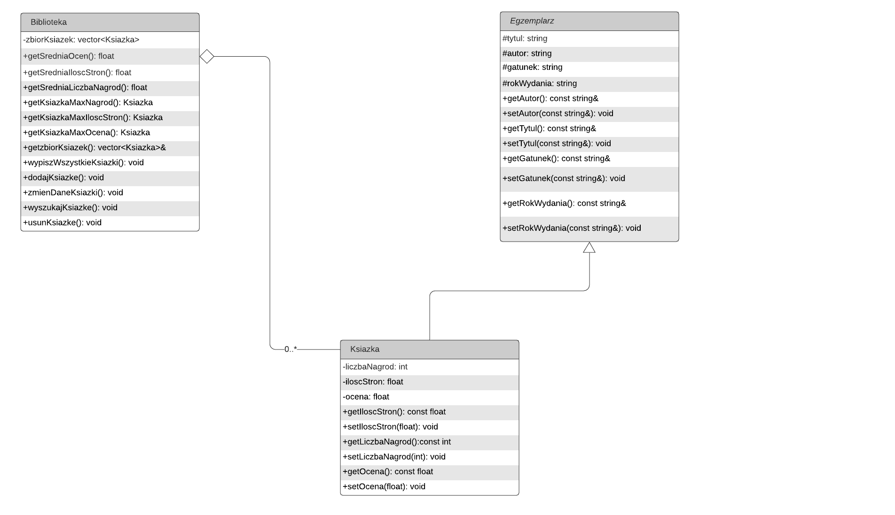

# Projekt indywidualny z programowania obiektowego -  Baza danych – Biblioteka

## Opis programu

Program ma za zadanie zebrać bazę danych książek w przydomowej bibliotece. Użytkownik programu ma możliwość:

- Dodania nowych książek
- Usunięcia książek
- Zmiany danych książek
- Wyszukiwania książek
- Wyświetlania statystyk
- Zapisania danych książek do pliku tekstowego

## Funkcjonalności

Podczas dodawania książki użytkownik może wprowadzić następujące dane:

- Tytuł
- Autor
- Gatunek literacki
- Rok wydania
- Liczba zdobytych nagród literackich
- Ilość stron
- Ocena czytelników (uzyskana z internetowych rankingów książek lub ocen osób, które przeczytały daną książkę)

## Statystyki

Program umożliwia wyświetlenie następujących statystyk:

- Średnia liczba nagród literackich na książkę
- Średnia ilość stron książki
- Średnia ocena czytelników
- Książka, która zdobyła najwięcej nagród
- Książka z największą ilością stron
- Najlepiej oceniona książka

## Technologie

Cały program oparty jest na użyciu wektorów (kontenerów STL), a wszystkie metody związane z danymi opierają się na metodach klasy `std::vector`.

Program zawiera także wyjątki, które są stosowane w sytuacjach związanych z nieprawidłowym użyciem programu (np. próba usunięcia lub zmiany danych książki, która nie istnieje).

Wyszukiwanie książek opiera się na użyciu wyrażeń regularnych (`regex`). Inspirację do implementacji tej funkcji zaczerpnąłem z artykułu: [C++ - Wyrażenia regularne C++11](https://cpp0x.pl/artykuly/Inne-artykuly/C++-Wyrazenia-regularne-C++11-boost/47).

## Diagram UML

Dana „Ksiazka” dziedziczy po klasie „Egzemplarz” oraz jest połączona agregacją z klasą „Biblioteka”. Klasa „Biblioteka” może posiadać nieskończoną liczbę „Ksiazka”, ale także może nie posiadać żadnej.

 
